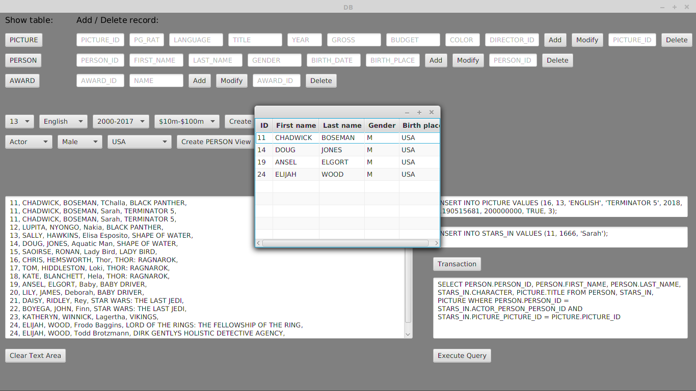

# Baza-danych

Aplikacja klient łącząca się z bazą danych 'films' na lokalnym serwerze MySQL.

Baza zawiera dane o filmach - data powstania, budżet, język, otrzymane nagrody; aktorzy i reżyserzy oraz ich dane itp.

Aplikacja umożliwia dodawanie, usuwanie i modyfikację rekordów, realizowanie transakcji, wyszukiwanie rekordów według zadanych warunków oraz realizację zapytań SQL.

Uruchomienie:

javac App.java

java -cp .:mysql-connector-java-5.1.46.jar App
